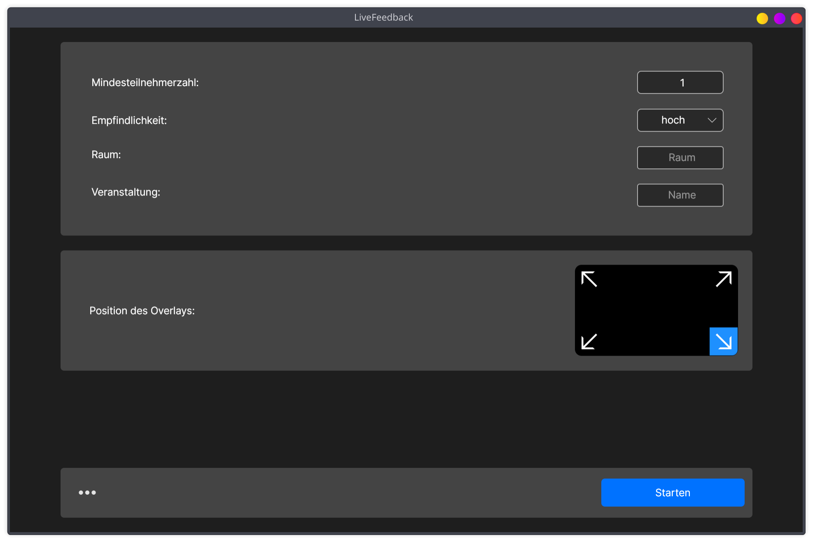
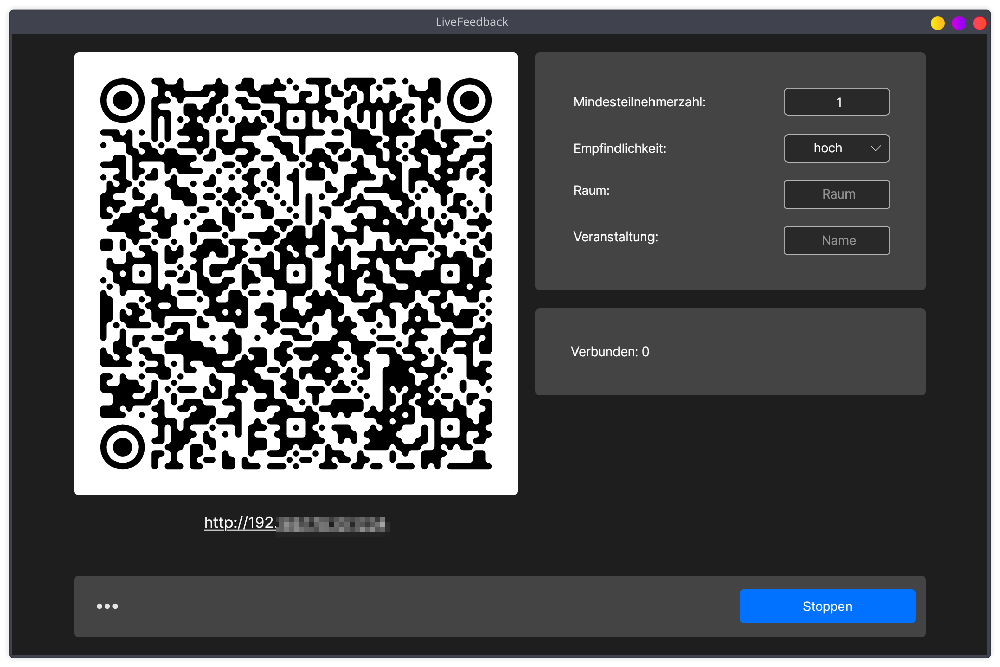
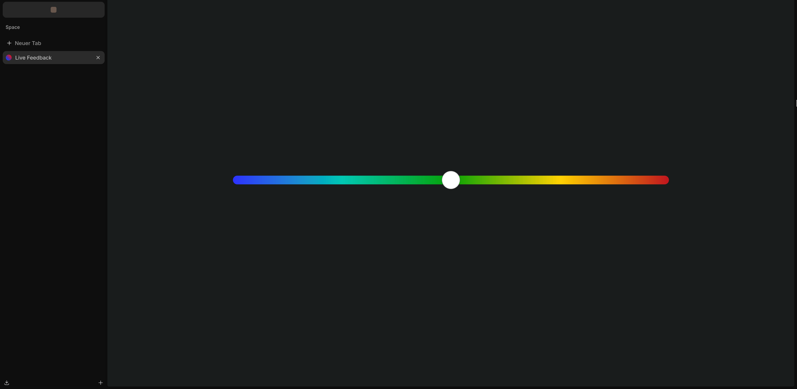

# LiveFeedback explained

LiveFeedback is a program that allows learners to give real-time feedback on comprehensibility during a lecture. The
lecturer/teacher starts the main program on the PC on which the presentation is being given, a QR code can be scanned by
the audience, which takes them to a web portal from which they can use a slider to adjust the comprehensibility from
“too easy” to “just right” to “too difficult”. The group's average rating is displayed as a colored, movable overlay
that appears on top of all windows, including presentation programs in full-screen mode (some Linux desktops, such as
KDE, do not support this feature, while others, such as GNOME and Windows, do; macOS support is unknown).

# Getting started

## Prerequisites

- .NET 10 SDK + runtime
- JS runtime and npm

## First steps:

1. Clone (a fork of) the repository to any location on your machine.
2. Create a copy of the `.env.example` file named `.env` in the project root.
3. Navigate to the LiveFeedback.Desktop folder and execute `dotnet run` for development, `dotnet publish` for release
   builds.

By default `PublishAot` is enable for faster startups. You can disable it in `LiveFeedback.Desktop.csproj` if you experience
issues to use the classic JIT compiled mode instead or to cross compile for other operating systems. This requires a
valid runtime to be present on the target machine though.

## Packaging:

If you have already installed the LiveFeedbackPackager dotnet cli tool, you can skip this step:

### Building and installing the LiveFeedbackPackager locally:

1. cd into `build/LiveFeedbackPackager`
2. Run `dotnet build --configuration Release` to build it.
3. Run `dotnet pack --output ./nuget-packages` to build a nuget package.
4. Run `dotnet tool install --add-source ./nuget-packages/ livefeedbackpackager --local` to install it.

### Building the package:

From anywhere within the Project run `dotnet build-package`.

This compiles the Avalonia desktop
application and builds a platform specific package, depending on the environment this is executed in. Add
`--skip-compile` to skip the dotnet publish and native AOC, which might take some time.

As of right now, only Linux and Windows are supported but support for more platforms is planned. On linux it builds a
Flatpak by default, on Windows a msi. More formats might be added in the future. Feel free to do so if you know how.

# Architecture

## LiveFeedback consists of several components:

- The **Avalonia desktop program**, which effectively serves as a central point for the presenter. From here, settings
  can be defined and the evaluations can be started/terminated. It is also responsible for displaying an overlay above
  all other windows. This currently only works under Windows and some Linux desktops. But some desktops like KDE
  disallow applications to display windows above a full screen focused window. Mac has not been tested. For those Linux
  desktops and possibly macOS, an extension for the presentation program would have to be created that communicates with
  the main program.
- A **Vue web frontend**: This is the web interface that listeners will see on their devices when they scan the QR code
  or enter the URL manually. It automatically connects to the server (even if the connection is interrupted by any
  standbys) and sends the new value to the server as soon as the slider is moved. If executed in monolithic mode, this
  is included in the main program.
- An **ASP.NET Core server**: This listens on port 5000 and serves as the central communication interface between the
  desktop program and the web front end. It uses SignalR under the hood to enable redundant real-time communication, so
  make sure that WebSockets are allowed if the server is running externally and not on the same host as the main
  program. If executed in monolithic mode, the server is included in the main program.
- A shared class library that contains shared types and functions

## Monolithic or distributed?

LiveFeedback can run in **two** ways:

- _monolithic_:
  In monolithic mode, all components run together on the same computer. This mode is preferred because it is easy to set
  up and less prone to errors. Limitation: The audience’s devices must be able to see and connect to the computer on
  which the presentation is being delivered.
- _distributed_:
  The distributed mode solves this problem. In this case, the LiveFeedback server and frontend run on an external
  server, which must be accessible to both the audience’s devices and the presentation PC instead of the presentation PC
  itself. In this case, only the main program runs on the presentation PC, which connects to the server via SignalR.
  This mode is currently still in a very early stage and prone to errors.

## Environment variables:

- required: `LIVE_FEEDBACK_MODE=local`  or `distributed`  specifies whether the components should assume that they are
  running locally or distributed. In case of distributed, the server parts assume that they are running in a docker
  container and default to the current working directory where they assume the wwwroot folder

- it depends: `LIVE_FEEDBACK_SERVER_HOST`: If you are using distributed mode, this is required. Set it to the correct
  host on the presentation PC and on the server. If it is not set correctly, the audience will not be able to access the
  correct web interface via the QR code. If you are using local mode, the program will always try to use a local IP of
  the current network that can be reached by the clients. If the presentation PC is connected to several networks at the
  same time or if you prefer a local domain instead of an IP address, you should set this environment variable as a
  precaution.

- it depends: `LIVE_FEEDBACK_ENVIRONMENT`  set to `dev` or `development` means that the compontents assume they are
  running in development mode, everything else will default to production mode.

- optional: `LIVE_FEEDBACK_WWWROOT`: LiveFeedback always tries to determine the wwwroot folder automatically based on
  the other two environment variables, but if it fails for some reason, you can use this to manually set the absolute
  path to the wwwroot folder.

- optional: `LIVE_FEEDBACK_SERVER_PORT` is used if you want or need to use a port other than the default port (5000).
